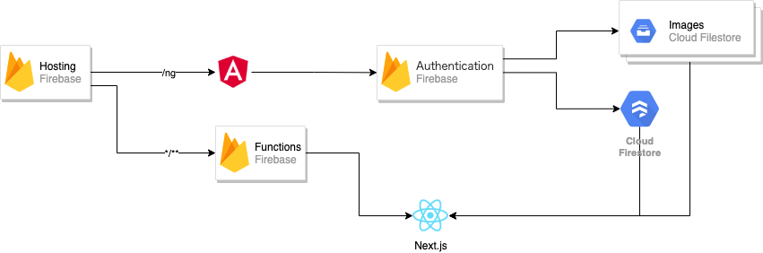

# sns karaage

https://sns-karaage.web.app/  
https://sns-karaage.web.app/ng  



## setup

```bash
npm install
cd functions && npm install
npm start
```


**firebase setting**

```bash
touch .env/firebase.ts
```

`.env/firebase.ts`

```typescript
export const firebaseConfig = {
  apiKey: "xxxxx",
  authDomain: "xxxxx",
  projectId: "xxxxx",
  storageBucket: "xxxxx",
  messagingSenderId: "xxxxx",
  appId: "xxxxx"
};
```

### viewer app start

```bash
npx nx run sns-karaage-view:serve
```

### editor app start

```bash
npx nx run editor-karaage:serve
```

create ui library  
```bash
npx nx g @nrwl/angular:library hoge
npx nx g @nrwl/angular:component fuga --project hoge
```

create pages
```bash
npx nx g @nrwl/angular:library page-hoge --routing=true
npx nx g @nrwl/angular:component page-fuga --project page-hoge
```

create service
```bash
npx nx g @nrwl/angular:library service-hoge
npx nx g @nrwl/angular:service service-hoge --project service-hoge
```
